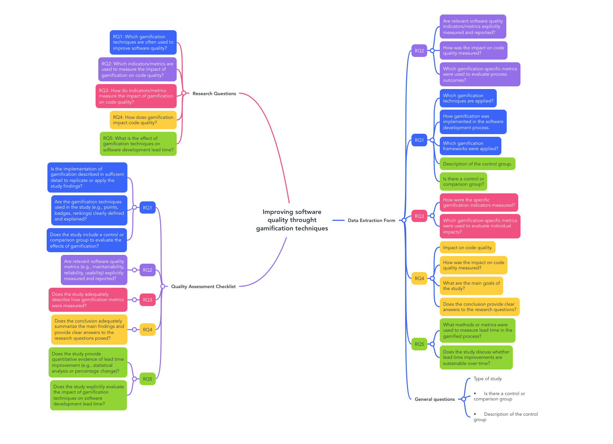

# Improving Software Quality Through Gamification Techniques

**Authors:** Lucas Linard, Sergio Antonio Andrade de Freitas

This secondary study aims to identify and analyze primary studies concerning how gamification techniques, such as points, badges, and rankings, affect software quality, especially code quality.

## Planning

This systematic review aims to investigate the influence of gamification techniques on software quality within the software development industry. Specifically, it aims to identify which gamification elements, such as points, badges, and rankings, are commonly employed and to assess their effectiveness in improving software quality metrics, particularly code quality.

### PICOC

- **Population:** Software engineers
- **Intervention:** Gamification
- **Comparison:** Control group inside the same company not using gamification techniques
- **Outcome:** Quantity of issues found by SAST analysis
- **Context:** Industry of software development

### Research Questions

1. Which gamification techniques are often used to improve software quality?
2. Which indicators/metrics are used to measure the impact of gamification on code quality?
3. How are indicators/metrics used to measure the impact of gamification on code quality?
4. How does gamification impact code quality?
5. What is the effect of gamification techniques on software development lead time?

### Keywords and Synonyms

#### Keyword:
- Synonyms

#### Control group:
- Unmodified system, baseline group, comparison group, conventional method, existing system, reference group

#### Gamification:
- Game elements, Gamification techniques, Rewards system

#### Software engineers:
- Developer, Development team, Engineers

#### Code quality:
- Code maintainability, Maintainability, Performance, Quality metrics, Reliability

#### Software quality:
- Quality assurance, software metrics

### Search String

`("Software engineers" OR "Developer" OR "Development team" OR "Engineers") AND ("Gamification" OR "Game elements" OR "Gamification techniques" OR "Rewards system") AND ("Control group" OR "Unmodified system" OR "baseline group" OR "comparison group" OR "conventional method" OR "existing system" OR "reference group" OR "software quality" OR "quality assurance" OR "software metrics") AND ("code quality" OR "Code maintainability" OR "Maintainability" OR "Performance" OR "Quality metrics" OR "Reliability")`

### Sources

- ACM Digital Library (http://portal.acm.org)
- EBSCO (http://ebsco.com)
- El Compendex (http://www.engineeringvillage.com)
- IEEE Digital Library (http://ieeexplore.ieee.org)
- ISI Web of Science (http://www.isiknowledge.com)
- Inspec (https://www.theiet.org/publishing/inspec)
- Science@Direct (http://www.sciencedirect.com)
- Scopus (http://www.scopus.com)
- Springer Link (http://link.springer.com)

### Selection Criteria

#### Inclusion Criteria:
- Papers focused on the application of gamification specifically in software development processes, software engineering, or related areas.
- Studies published within the last 10 years (or adjust according to scope) to ensure recent and relevant data.
- Studies written in English or Spanish to maintain consistency and accessibility.

#### Exclusion Criteria:
- Studies focusing on gamification in unrelated fields (e.g., education, healthcare, non-software-related industries).
- Studies for which the full text is not accessible, as these cannot be analyzed in depth.

### Quality Assessment Checklist

#### Questions:

- Does the conclusion adequately summarize the main findings and provide clear answers to the research questions posed?
- Does the study provide quantitative evidence of lead time improvement (e.g., statistical analysis or percentage change)?
- Are the gamification techniques used in the study (e.g., points, badges, rankings) clearly defined and explained?
- Is the implementation of gamification described in sufficient detail to replicate or apply the study findings?
- Does the study address gamification specifically within the context of software engineering or software development processes?
- Does the study include a control or comparison group to evaluate the effects of gamification?
- Are relevant software quality metrics (e.g., maintainability, reliability, usability) explicitly measured and reported?
- Does the study explicitly evaluate the impact of gamification techniques on software development lead time?

#### Answers:
- Yes
- Partially
- No

### Data Extraction Form

- **Type of study**:
- **What are the main goals of the study?**:
- **Does the conclusion provide clear answers to the research questions?**:
- **Which gamification techniques are applied?**:
- **How gamification was implemented in the software development process.**:
- **Is there a control or comparison group**:
- **Which gamification frameworks were applied?**:
- **Description of the control group**:
- **Are relevant software quality indicators/metrics (e.g., ISO 25010 metrics) explicitly measured and reported?**:
- **Impact on code quality**:
- **How impact on code quality was measured?**:
- **Impact on Lead Time**:
- **How impact on Lead Time was measured?**:
- **Additional notes**:
- **Which gamification-specific metrics were used to evaluate process outcomes**:
- **How were the specific gamification indicators measured?**:
- **Which gamification-specific metrics were used to evaluate individual impacts?**:

### Mind map of research questions, Quality assessment and Data Extraction form
- 